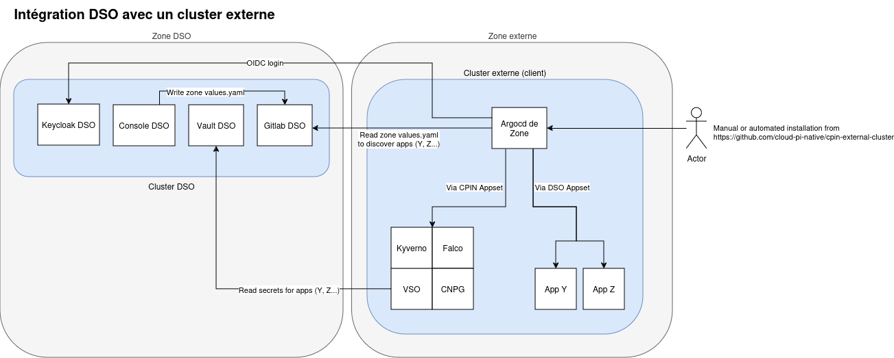

# Bring You Own Cluster

Ce projet a pour but de répliquer autant que possible le développement sur CPiN depuis un cluster personnel afin de faciliter la transition vers un cluster de production géré par CPiN.

## Architecture

Le projet va déployé un ArgoCD qui va piloter les déploiements de la zone associée au cluster.

Deux appset seront créés:

- cpin-appset: appset qui sera en charge d'installer les outils de sécurité pour mimer au mieux un cluster CPiN
- dso-appset: appset qui est chargé de déployer les applications créées dans la console hexaforge

Pour récupérer les sources, les secrets, l'authentification, un flux devra être ouvert vers le cluster DSO opéré par les équipes de Cloud Pi Native




## Pré-requis

Client:

- les briques (gitlab, keycloak, vault) de la console DSO doivent être accessible (ouverture de flux, etc...): sur OVH *.apps.dso.numerique-interieur.com
- créer un cluster kubernetes et fournir le kubeconfig
- un ingressController sur le cluster: Openshift utilise un HAProxy repackagé.
- générer une configuration pour sops
- avoir l'url du futur ArgoCD

Service Team:

- déclarer une zone dédiée dans la console DSO (voir [ServiceTeam.md](ServiceTeam.md))
- fournir les informations de connexion pour Keycloak (clientID, clientSecret)
- fournir le secret pour l'authentification d'ArgoCD à GitLab

Ce chart part du principe qu'un ingress controller est installé. Si ce n'est pas le cas, un exemple pour installer un nginx est disponible dans le dossier **terraform/init**

## Installation

L'installation se déroule en 3 étapes:

1. Préparation des variables
2. Installation ArgoCD + des applications sets
3. (Automatique) Installation des autres briques via argocd

### Étape 1

- Encoder en Base64 votre fichier SOPS. Par exemple le fichier de clé suivant :

  ```txt
  # created: 2024-09-26T09:58:11+02:00
  # public key: age13pzeffy3d4mrfzy3n6mc03v5secs57n0jju5vndhynmzasxx63lq33y3gm
  AGE-SECRET-KEY-1UTLA4FQQD3MJMUEGNEXF94K9MS4YFPF2MAHQR6YMDRCLE0PEK9XSQKQE4T
  ```

  devient en base 64 :

  ```txt
  IyBjcmVhdGVkOiAyMDI0LTA5LTI2VDA5OjU4OjExKzAyOjAwDQojIHB1YmxpYyBrZXk6IGFnZTEzcHplZmZ5M2Q0bXJmenkzbjZtYzAzdjVzZWNzNTduMGpqdTV2bmRoeW5temFzeHg2M2xxMzN5M2dtDQpBR0UtU0VDUkVULUtFWS0xVVRMQTRGUVFEM01KTVVFR05FWEY5NEs5TVM0WUZQRjJNQUhRUjZZTURSQ0xFMFBFSzlYU1FLUUU0VA==
  ```

- Préparer en local le fichier `custom-values.yaml` à la racine du présent dépôt et remplacer les `# valeurs spécifiques` :

  ```yaml
  dsoZoneRepo: # Url du dépôt Gitlab pour la zone DSO avec un .git
  appValues:
    sops:
      key:
        base64_content: # Base64 de votre fichier SOPS
  global:
    domain: # Nom de domaine cible pour cet ArgoCD
  argo-cd:
    configs:
      cm:
        oidc.config: |
          name: Keycloak
          issuer: # Url du Keycloak DSO cible
          clientID: # Client ID à récupérer dans Keycloak (realm DSO)
          clientSecret: # Secret Keycloak correspondant (onglet Credentials)
          requestedScopes: ["openid", "groups"]
    server:
      ingress:
        hosts:
          - # Nom de domaine cible pour cet ArgoCD
        tls:
          - hosts:
              - # Nom de domaine cible pour cet ArgoCD
  ```

Demander auprès de la ServiceTeam le secret d'authentification auprès de GitLab (fichier nommé gitlab-secret.yaml pour la suite):

```yaml
apiVersion: v1
data:
  password: 
  url: 
  username: 
kind: Secret
metadata:
  labels:
    argocd.argoproj.io/secret-type: repo-creds
  name: gitlab
type: Opaque

### Étape 2

Assurez-vous d'avoir le bon contexte Kubernetes (fichier .kube/config ou variable d'environnement KUBECONFIG) et lancez les commandes suivantes :

```sh
kubectl apply -k https://github.com/argoproj/argo-cd/manifests/crds\?ref\=stable
helm repo add argo https://argoproj.github.io/argo-helm
helm dependency build argo-cd
helm upgrade --install --create-namespace -n argo-cpin -f custom-values.yaml argocd argo-cd
kubectl -n argo-cpin apply -f gitlab-secret.yaml
```

Attendre quelques minutes le temps que toutes les applications s'installent.

### Étape 3

Connectez-vous à votre instance ArgoCD avec le mot de passe admin et surveillez l'installation des différents outils.

Pour récupérer le mot de passe admin :

```shell
kubectl -n argo-cpin get secret argocd-initial-admin-secret --template="{{ .data.password | base64decode}}"; echo ""
```

## Post-Config

### Création du secret de connexion au cluster

ArgoCD a besoin d'un secret pour pouvoir se connecter au cluster afin de déployer les applications clientes.

**Ce secret doit spécifier le même nom de cluster que celui déclaré dans la console**

Le script `kubeconfig-to-cluster-secret.sh` permet de générer le yaml du secret à partir d'un kubeconfig:

```sh
./kubeconfig-to-cluster-secret.sh -k <kubeconfig path> -n <cluster name> [-c <context_name>] [-i <https://cluster_api_ip:443>]
kubectl -n argo-cpin apply -f <cluster-name>-cluster-secret.yaml
```

*Si vous modifiez le secret pour avoir comme url: `https://kubernetes.default.svc`, cela va supprimer le secret **in-cluster**. Attention aux applications qui utilisent ce nom de destination au lieu de l'url de destination.*

## Différence avec l'offre Cloud Pi Native au MI

### CDS

#### Certificat

Les certificats sont portés par la CDS, pas besoin de générer des ingress TLS

### Openshift

#### Réseaux

L'IngressController d'Openshift est basé sur HAProxy, repackagé par RedHat. Il ne répond donc pas aux mêmes annotations que l'opérateur officiel.

Voir la documentation [ici](https://docs.openshift.com/container-platform/4.15/networking/routes/route-configuration.html#nw-route-specific-annotations_route-configuration)

Openshift a une notion de route en plus des ingress, pas besoin de s'en préoccuper: une route sera automatiquement créée pour chaque ingress créé.

#### Sécurité

Openshift est une distribution sécurisée de kubernetes qui génère automatiquement un [security context](https://kubernetes.io/docs/tasks/configure-pod-container/security-context/) pour les pods conforme au [PSS](https://kubernetes.io/docs/concepts/security/pod-security-standards/) en mode **restricted** et avec pour la propriété **runAsUser** un nombre aléatoire.

Afin de mimer au mieux les contraintes d'Openshift, ce repo active (pour les namespaces liés à un projet dans la console DSO) les [PSS](https://kubernetes.io/docs/concepts/security/pod-security-standards/) en mode **restricted**. Il faudra définir soit même le security context pour les pod, en pensant bien à mettre une valeur aléatoire pour la propriété **runAsUser**.
